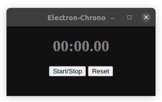

# Electron-chrono
A Hello-world Application for learning Electron: A simple chronometer

## Installation

* Clone the repo
* Install the dependencies: ```npm install```

* Execute:
```npm start```



## Generating the Linux Appimage

Just run:

```npm run dist```

The executable for linux will be in the `dist` folder

## Release

For Releasing a new version, follow these steps:

* Update the version in the `package.json` file (Ej. v1.0.2)
* Commit that change (`git commit -am v1.0.2`)
* Tag the commit (`git tag v1.0.2`)
* Push to GitHub (`git push && git push --tags`)

Credits: [Electron Builder Action](https://github.com/samuelmeuli/action-electron-builder), by @samuelmeuli (Thanks!!!)😀️
